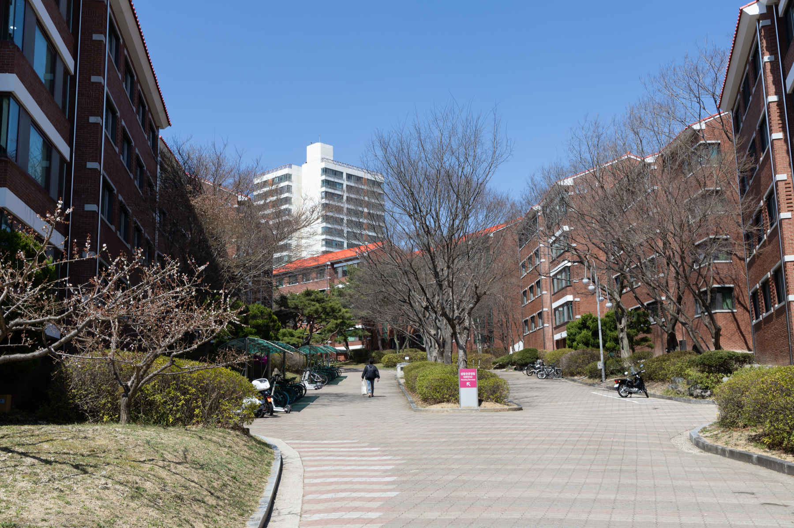
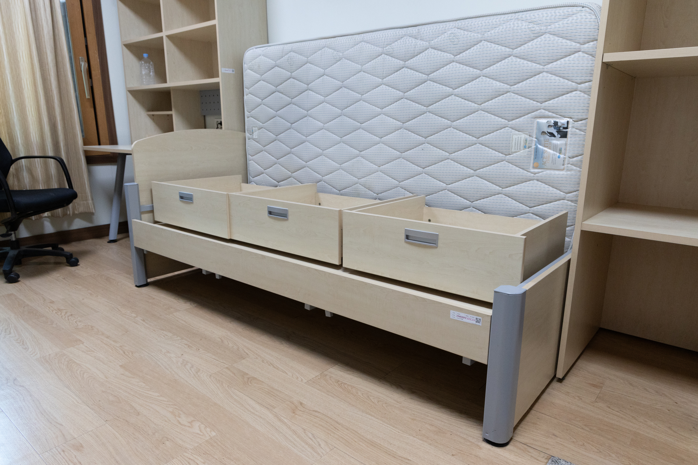
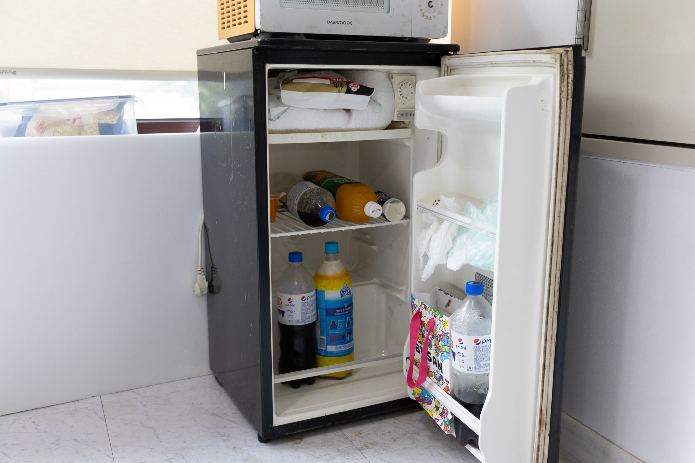

+++
title = 'POSTECH 国際学生寮 DICE'
date = 2024-08-02T21:07:29+09:00
draft = false
image = 'dice-entrance.jpg'
description = 'POSTECHの国際学生寮DICEについて紹介します。'
+++

POSTECHには留学生向けの学生寮DICEがあります。留学生は基本的にこの寮に滞在することになります。民間のアパートなどに住むことも可能ですが、通学距離や家賃などを考慮すると寮の方が便利です。

寮は4階建てで、1-3階が男性部屋、4階が女性部屋になっています。そのため、本記事では男性部屋のエリアを中心に紹介します。

  

## 立地

DICEはキャンパス内にあり、**食堂やコンビニがある建物には徒歩1分**ほどの距離です。そのため、日常生活は非常に便利です。
また、周囲には現地の韓国人学生が住む学生寮があります。

## 家賃

家賃は**1ヶ月で約1万7000円**ほどで非常に安価です。週単位で計算され、1週間あたり36250ウォン（約3900円）です。水道代や電気代は家賃に含まれており、別途支払う必要はありません。現地に行ってから、ある程度決まった期間の家賃を一括で振り込むことになります。

## 清掃

共有スペースや水回りは**平日は毎日清掃が入ります**。そのため、基本的には清潔な状態を保つことができます。一方で、個人の部屋は自分で掃除する必要があります。

## 部屋

部屋は基本的に2人部屋です。部屋にはベッド、机、椅子、収納棚、エアコンが備え付けられています。また、Wi-Fiは各部屋毎に利用でき、大学のネットワークと繋がっているため、大学が契約している論文を閲覧したりできます。

以下の写真は、空き部屋を撮影したものです。この写真ではベッドの整備がされていませんが、実際に入居する際には、マットレスを敷き、収納棚はベッド下に置くことになります。なお、かけ布団、シーツ、枕などは、事前に申請しておくことでレンタル（有料）することができます。

   

   

## 共有スペース

個人の部屋以外にも共有スペースがあります。広いテーブルと椅子が設置されており、食事や作業をするのに利用できます。また、キッチンもあるので、簡単な料理をすることも可能です。

### 1階共有スペース

   

### 2階共有スペース

   

   

## 水回り

各階に水回りが設置されており、洗面所・洗濯機・乾燥機・トイレ・シャワールームがあります。

洗濯機と乾燥機は1回の使用につき500ウォンです。あらかじめチャージした専用のカードを使用して支払います。洗剤は自分で用意する必要があります。

シャワールームでのシャンプーやボディーソープは、各自で用意する必要がありますが、留学開始時に大学から1ボトル分もらえました。

   

   

   

## エントランス

   

